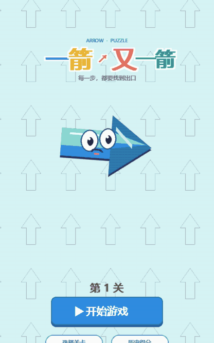
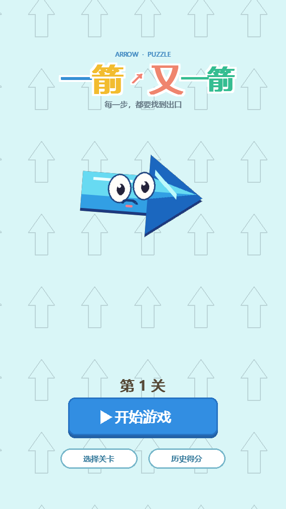
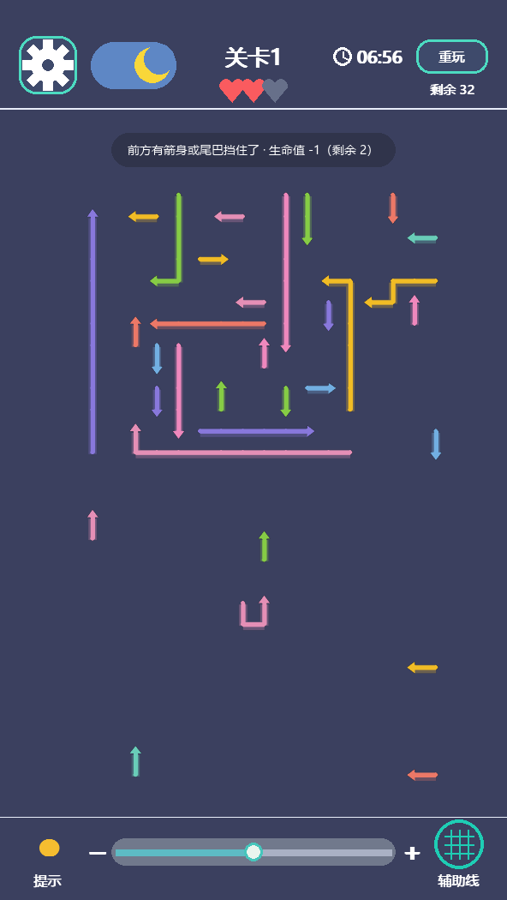
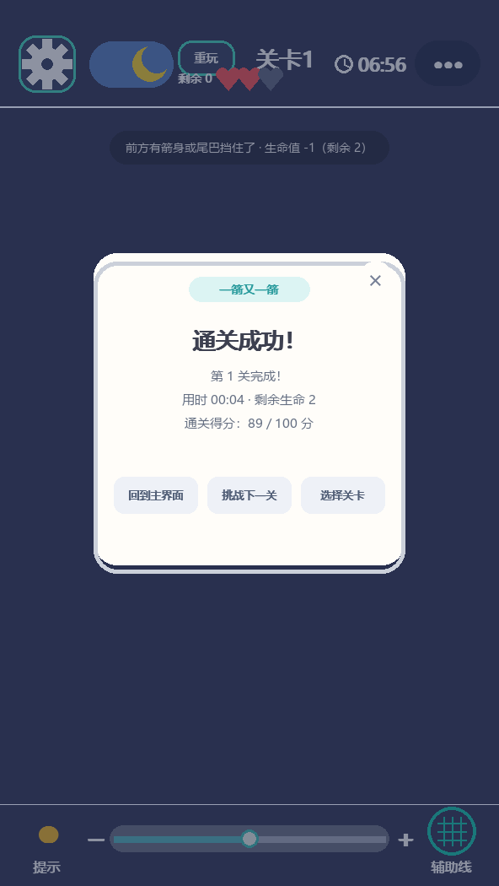
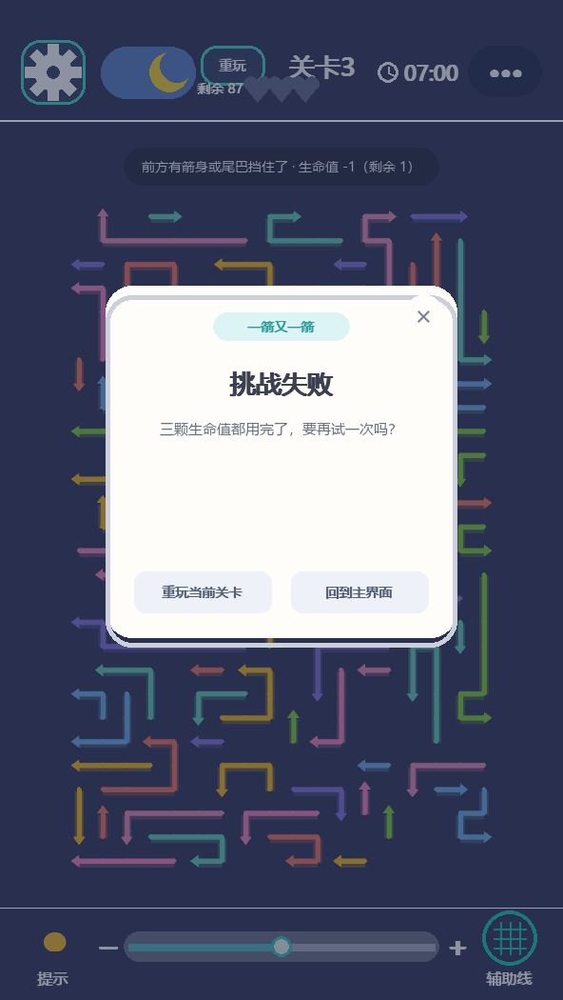
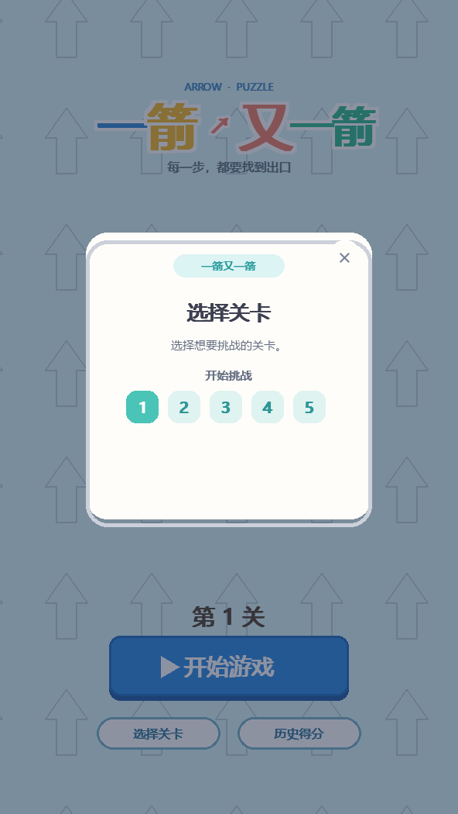
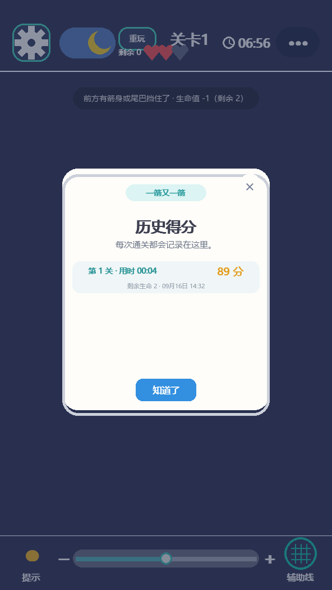

# 软件工程课程第二次个人作业：利用 AIGC 完成“一箭又一箭”小游戏

| 项目 | 内容 |
|---|---|
| 这个作业属于哪个课程 | [2026-01 软件工程和软件工程实践](https://edu.cnblogs.com/campus/fzu/2026-01SoftwareEngineeringandSoftwareEngineeringPractice) |
| 这个作业要求在哪里 | [软件工程课程第二次个人作业](https://edu.cnblogs.com/campus/fzu/2026-01SoftwareEngineeringandSoftwareEngineeringPractice/homework/16718) |
| 这个作业的目标 | 使用 Python 和 AIGC 完成“一箭又一箭”小游戏 |
| 学号 | 102402150 |
| GitHub 仓库 | [github.com/zzq1419/arrow-arrow](https://github.com/zzq1419/arrow-arrow) |

> 全文只使用自己编写的关卡数据、绘制代码和规则代码，没有使用原商业游戏的代码、素材、
> 音效或关卡。代码片段都来自仓库里的 `arrow_game.py`，图片对应 `assets/` 目录。

## 一、项目展示

项目名称：**一箭又一箭**。棋盘上散布着许多带方向的箭头，玩家要观察箭头之间的阻挡
关系，按合适的顺序把箭头一支支放走。

下面这段动图是从开始界面进入游戏、连续放飞三支箭头、再故意点一支被挡住的箭头
（生命值 -1、顶部弹出碰撞提示）的完整过程，由程序真实运行后逐帧录制：



运行方式（Windows 也可以直接双击 `run_python_game.bat`）：

```powershell
python -m pip install -r requirements.txt
python arrow_game.py
```

### 1. 开始界面

显示游戏标题、当前关卡和“开始游戏 / 选择关卡 / 历史得分”三个入口。背景是缓缓流动的
箭头底纹，用 `pygame.draw` 画出来的，没有任何图片素材。



### 2. 游戏界面

顶部左侧是设置齿轮和日夜开关，中间是关卡号和生命值（三颗爱心）以及倒计时，右上角竖排
“重玩”按钮和剩余箭头数；中间是棋盘，底部是“提示”、缩放滑杆和“辅助线”开关。
下面这张取的是**第 5 关**（箭头最多、棋盘最密的一关）。
截图上方那条深色提示条就是**碰撞反馈**：点了一支被挡住的箭头，生命值从 3 变成 2。



### 3. 通关 / 失败界面

清空最后一支箭头后弹出通关结果（用时、剩余生命、得分），可以回到主界面、挑战下一关
或重新选关；三次误点后生命耗尽则弹出失败结果，可以直接重玩或回到主界面。

| 通关成功 | 挑战失败 |
|---|---|
|  |  |

### 4. 其他界面

| 选择关卡 | 历史得分 |
|---|---|
|  |  |

## 二、项目介绍

### 1. 游戏规则

棋盘是 18 列 × 28 行的网格，每支箭头占据**若干个连续格子**：箭身像一条折线，最后
一格是头格，头格的朝向是上、下、左、右四个方向之一。点击一支箭头后，程序从头格的
相邻格开始，沿箭头朝向一格一格检查到棋盘边界：

- 路径上**没有**阻挡（也不能撞到自己的尾巴），箭头沿朝向飞出棋盘并消失；
- 路径上**有**阻挡，箭头留在原地，算一次失误，生命值 -1，顶部给出提示；
- 生命值共 3 点，归零本关失败；清空全部箭头即通关，可进入下一关。

### 2. 界面设计

界面全部用 `pygame.draw` 从零绘制，仓库里因此不需要任何美术资源。几个取舍：

- 棋盘先按 3 倍分辨率渲染再 `smoothscale` 缩小，缩放窗口时线条依然平滑；
- 箭头是非自交折线，圆角用“在拐点画圆”补齐，箭尖用三角形绘制；
- 功能按钮集中在底部固定工具条，不和棋盘抢位置；
- 提供日间 / 夜间两套配色。

### 3. 主要功能

| 功能 | 说明 |
|---|---|
| 三个界面 | 开始界面、游戏界面、通关 / 失败弹窗 |
| 路径检测 | 判断头格到棋盘边界之间是否存在阻挡 |
| 飞出动画 | 箭头沿自己的朝向平移出棋盘，出界后从棋盘移除 |
| 碰撞反馈 | 箭头原地不动 + 顶部提示条 + 生命值 -1 |
| 关卡与流程 | 五个关卡、生命归零判负、重玩恢复初始状态 |
| 附加功能 | 关卡选择、提示高亮、辅助线、缩放拖动、日夜模式、计分与历史得分 |

### 4. 与作业基础要求的对应

作业基础版要求“网格中的单格箭头”，本项目保留了原游戏更接近的形态：一支箭头占多个
格子，头格决定朝向。**这是单格规则的自然推广**——单格箭头只是“箭身长度为 1”的特例。
多出来的只有一处：一支箭头自己的尾巴落在头格前方时也会挡住自己。除此之外路径检测的
判断方式与作业完全一致：仍然只看同一行或同一列、只看箭头与边界之间有没有东西。

## 三、实现思路

### 1. 箭头和方向怎么表示

坐标统一用 `(col, row)`，即 `(列, 行)`。四个方向直接写成 `(dx, dy)` 向量：

| 方向 | 右 → | 左 ← | 下 ↓ | 上 ↑ |
|---|---:|---:|---:|---:|
| dx | +1 | -1 | 0 | 0 |
| dy | 0 | 0 | +1 | -1 |

这样“沿方向走一格”就是一次向量加法 `(col + dx, row + dy)`，四个方向不需要写四套分支。
一支箭头用一个数据类表示，`path` 是箭身经过的格子（最后一格是头格），`dx / dy` 是头格
朝向，再加上颜色和几个动画字段；整关的状态（箭头列表、棋盘尺寸、生命值、倒计时、
是否通关 / 判负 / 动画中）装在 `GameState` 里。

### 2. 路径检测（重点）

只需要关心箭头**头格**。从“头格 + 方向”开始，一格一格往前走，只要还没走出棋盘，
就看这一格是不是被别的箭头占了：

```python
def arrow_can_leave_from_occupied(arrow, occupied, cols, rows) -> bool:
    head_col, head_row = arrow.path[-1]
    col, row = head_col + arrow.dx, head_row + arrow.dy
    while 0 <= col < cols and 0 <= row < rows:
        if (col, row) in occupied:
            return False
        col += arrow.dx
        row += arrow.dy
    return True
```

三个关键点：

1. **检查整条路径，不是相邻一格。** `while` 一直走到坐标越界为止，所以中间隔着十个
   空格子的箭头同样算阻挡；
2. **循环条件本身就是边界处理。** `col` / `row` 越界时循环直接结束并返回 `True`，
   不会访问到数组外面——这正是 T03 要验证的行为；朝向棋盘外的箭头，循环体一次都
   不执行，直接判定可以飞出；
3. **`occupied` 里包含这支箭头自己的格子。** 所以自己的尾巴落在头格前方时同样判为
   阻挡，提示文案会说“前方是自己的尾巴，不能走”。

界面上还要告诉玩家“被谁挡住了”，所以另有一个返回阻挡者信息的版本，它把 `occupied`
从“格子集合”换成“格子 → 箭头”的字典：

```python
def get_block_info(arrows, arrow, cols, rows) -> dict:
    occupied = {cell: owner for owner in arrows for cell in owner.cells}
    head_col, head_row = arrow.path[-1]
    col, row = head_col + arrow.dx, head_row + arrow.dy
    cells = []
    while 0 <= col < cols and 0 <= row < rows:
        if (col, row) in occupied:
            return {"blocked": True, "cells": cells, "blocker": (col, row),
                    "owner": occupied[(col, row)]}
        cells.append((col, row))
        col += arrow.dx
        row += arrow.dy
    return {"blocked": False, "cells": cells, "blocker": None, "owner": None}
```

于是点击处理就是一次三选一：不合法（正在动画 / 已判负 / 已通关）直接忽略；被阻挡就
扣生命并给提示；合法就进入飞出动画。提示文案用 `info["owner"] is arrow` 区分
“被自己的尾巴挡住”和“被别的箭头挡住”。

### 3. 飞出动画与关卡生成

箭头飞出不是直接消失，而是“整条箭身沿朝向平移出棋盘”。做法是把头格的路径按朝向延长
若干格拼成一条完整路线，每帧按时间比例取插值位置绘制，整条路线走完才把箭头从
`arrows` 里移除；移除后列表为空就说明通关。

关卡不是写死的数组，而是带种子（可复现）的程序化生成，因为手写关卡很容易写出
“看起来能过、实际是死局”的布局。`build_level()` 分四步：基础箭头 → 延长箭身 →
填缝 → 兜底修复，**每一步插入箭头后都立刻跑一次可解性校验，不可解就回滚这一步**。
可解性校验是个贪心搜索——每一步找出“当前没有阻挡的箭头”移除一个，某一步一个都找不到
就说明是死局。生成器还会算一份难度画像（每步有多少合法选择、有多少步唯一解），用来
挑选真正有思考量的布局。最终五关的箭头数是 **58 / 79 / 87 / 99 / 136**，逐关递增，
每一关都能通关。

### 4. 游戏状态与流程

```
开始界面 ──开始游戏──▶ 游戏界面
                          │
         ┌────────────────┼────────────────┐
    点空/无效          合法点击        被阻挡点击
     （忽略）        （飞出动画）    （生命 -1 + 提示）
                          │                │
                   棋盘清空？          生命 = 0 ？
                          │                │
                      通关弹窗          失败弹窗
                          │                │
                   下一关 / 回主页    重玩 / 回主页
```

“重玩”是重新克隆一份关卡模板：箭头布局、生命值、倒计时、飞出状态全部回到初始值，
所以不会把上一局的状态带进来。

## 四、AIGC 使用过程

这个项目全程使用 Codex 协作。下面五次是有代表性的过程，都来自真实开发过程。

| 子任务 | 使用何种 AIGC 技术 | AI 实现或提供了什么 | 效果如何 | 人工修改 |
|---|---|---|---|---|
| 结构与骨架 | Codex | `Arrow` / `GameState` 数据结构、`pygame` 主循环、棋子绘制骨架 | 能跑，但规则、生成器、界面全塞在一个文件里 | 我定下“关卡必须保证可解”这条硬性要求，让可解性检查成为生成流程的一部分 |
| 路径检测 | Codex | 整条射线扫描的 `arrow_can_leave_from_occupied` | 远距离阻挡、自己的尾巴阻挡都能识别 | 我补了贴边阻挡、贴边朝外飞出两组边界用例 |
| 关卡生成 | Codex | 带种子的 `build_level()` + 可解性校验 | 五关全部可解，箭头数逐关递增 | 我要求难度递增，并把五关都实际清了一遍 |
| 界面排错 | Codex | 按字宽和控件矩形重算排版 | 顶栏不再互相压住 | 我要求只挪文字锚点、不动点击热区，逐张截图核对 |
| 测试与修复 | Codex | 69 项 `unittest`，用 SDL dummy 无窗口驱动真实界面 | 测出一个真实缺陷：超时判负后棋盘卡死 | 我在 `shoot()` 守卫里补上 `self.game.dead` |

### 过程一：先确定“方向即向量”

**我的要求**：先把数据结构和主循环搭起来，箭头要有上下左右四个方向，点击后能判断
前方有没有阻挡。

**AI 完成的工作**：给出 `Arrow`（路径 + 方向 + 颜色）和 `GameState`，以及窗口创建、
事件循环和箭头绘制函数。

**实际效果与修改**：第一版能跑，但四个方向在绘制和检测里各写了一套 `if` 分支，后面
加功能很容易漏改其中一个。我要求把方向统一成 `(dx, dy)` 向量，检测、飞出路线、动画
插值全走一条代码路径。改完之后，加“飞出动画”时几乎没再动过检测逻辑。

### 过程二：路径检测从“相邻一格”改成“整条射线”

**我的要求**：不要只看相邻一格。箭头前面可能隔着好几个空格才有别的箭头，那也算被挡住；
另外箭头是蛇形的，尾巴正好在头前面时也应该算被自己挡住。

**AI 完成的工作**：把判断改成从 `头格 + 方向` 开始逐格推进，用 `while 0 <= col < cols
and 0 <= row < rows` 控制边界；同时补了一个 `get_block_info()` 返回阻挡者，用来生成提示。

**实际效果与修改**：远距离阻挡能识别，后方和其他行列的箭头不会被误判，朝向棋盘外
也不会越界。我把“自己的尾巴”从隐式行为改成显式提示（用 `info["owner"] is arrow` 判断），
并补了两组边界测试。

### 过程三：关卡改成程序化生成

**我的要求**：不要手写死关卡数据。要五关、难度递增、四个方向都要出现，而且**每一关
都必须能通关**，不能出现死局。

**AI 完成的工作**：写了带种子的 `build_level()`，四步生成，每插入一个箭头就调用一次
可解性校验，不可解立刻回滚；还产出一份难度画像。

**实际效果与修改**：五关全部通过可解性检查，箭头数 58 / 79 / 87 / 99 / 136，同一
种子每次生成的布局完全一致。第一版难度曲线是乱的（第 3 关比第 4 关还多），我把每关的
箭头数量下限、箭身长度范围提成配置表 `LEVEL_CONFIGS`，再逐关实际清了一遍确认有解。

### 过程四：顶栏排版两次返工

**我的要求**：游戏界面顶栏的文字和按钮挤在一起了，帮我查哪里重叠；后来进一步要求
把“重玩”和剩余箭头数统一挪到右上角，并去掉那个三个点的菜单按钮。

**AI 完成的工作**：把所有控件的矩形和文字锚点列出来做交叉比对。第一轮指出“关卡号”
标题居中在 `(296, 44)`，而“重玩”按钮占 `x 211~279`、`y 48~90`，左上角区域重叠；
“剩余 N”锚点在 `(214, 93)`，左半边压住了日夜开关的胶囊底图。第二轮按我的要求重排：
“重玩”移到 `(486, 46, 84, 40)`，“剩余 N”竖排在其下方 `(528, 104)`，关卡标题回到真正的
水平中心 `(296, 66)`，倒计时挪到 `(400, 66)`，并删掉了 `(492, 48, 78, 54)` 的“•••”
按钮及其对应的弹窗分支。

**实际效果**：两处挤压都消失，明暗两套配色下顶栏都不再重叠。

**人工修改**：第一轮我要求只动文字锚点、**不移动任何可点击按钮**，避免动到已经验证过
的点击热区；第二轮挪了按钮之后，我同步更新了测试里的点击坐标，并补了两条新测试——
一条确认“•••”原位置不再弹窗，一条确认点“重玩”不会误触日夜开关。

### 过程五：写测试测出一个真 bug

**我的要求**：按作业要求的 T01 ~ T06 写自动化测试，但不能只测孤立函数，要用真实的
游戏对象跑完整流程，并覆盖边界和异常。

**AI 完成的工作**：写了 69 项 `unittest`，用 `SDL_VIDEODRIVER=dummy` 无窗口创建真实
游戏对象，覆盖规则层、关卡生成、界面流程和命令行入口。跑起来后其中一条失败了：

```
test_clicking_the_board_after_a_timeout_does_not_freeze_the_game
AssertionError: True is not false : 已经判负的关卡不应该进入飞出状态
```

**实际效果（关键）**：顺着这个失败查下去，找到的是一个真实缺陷。倒计时归零时
`update_game()` 会把 `game.dead` 置为 `True` 并弹出“时间到啦”弹窗；此时如果用户关掉
弹窗再点棋盘，`shoot()` 的守卫只挡了 `moving / busy / complete`，**没有挡 `dead`**，
于是箭头被置为“飞行中”。而 `update_game()` 在 `dead` 之后会直接 return，永远不会再
推进动画。结果这支箭头永远停在飞行状态、`busy` 恒为 `True`，整个棋盘**永久卡死**，
点哪里都没反应，只能靠“重玩”救回来。

**人工修改**：在守卫里补上 `self.game.dead`，并留下这条回归测试防止以后再漏。

## 五、测试结果

### 1. 测试方法

用 Python 标准库 `unittest` 编写，共 **69 项**，分四层：

```powershell
python -m unittest discover -s tests -v
```

| 测试类 | 项数 | 覆盖内容 |
|---|---:|---|
| `ArrowRulesTests` | 19 | 路径检测、边界处理、失误扣减、计分、工具函数 |
| `LevelGenerationTests` | 12 | 关卡结构、四方向齐全、可解性、可复现性、克隆隔离 |
| `ArrowPuzzleFlowTests` | 37 | 用 SDL dummy 无窗口驱动真实界面：开始/点击/飞出/通关/失败/重开/顶栏热区 |
| `CommandLineTests` | 1 | `--smoke-test` 命令行入口能正常退出 |

关键点：`ArrowPuzzleFlowTests` 真的创建了游戏对象，然后按**真实鼠标路径**点击——
把格子中心换算成窗口坐标再调用 `handle_mouse_down`，所以它同时验证了“点击热区正确”
和“规则正确”，而不是绕过界面直接调规则函数。

### 2. 基本要求测试（T01 ~ T06）

| 编号 | 测试内容 | 预期结果 | 实际结果 | 是否通过 |
|---|---|---|---|---|
| T01 | 点击前方无阻挡的箭头 | 箭头飞出棋盘并消失 | 进入飞出动画，结束后箭头被移除，剩余箭头数 -1，生命值不变 | 通过 |
| T02 | 点击前方有阻挡的箭头 | 箭头不消失，失误次数减 1 | 箭头留在原地且不进入动画，生命值 3 → 2，顶部出现“前方有箭身或尾巴挡住了 · 生命值 -1（剩余 2）” | 通过 |
| T03 | 点击位于边缘且朝向棋盘外的箭头 | 箭头正常消失，不发生越界错误 | 四个边缘方向各测一次，均正常飞出消失，无越界异常 | 通过 |
| T04 | 消除本关全部箭头 | 显示通关并进入下一关 | 清空后弹出“通关成功！”，点“挑战下一关”进入第 2 关且棋盘重置 | 通过 |
| T05 | 失误次数耗尽 | 显示失败并允许重新开始 | 第 3 次误点后生命归零，弹出“挑战失败”，点“重玩当前关卡”后生命恢复为 3、棋盘恢复初始布局 | 通过 |
| T06 | 游戏进行中重新开始 | 箭头布局和失误次数恢复 | 飞掉 3 支箭头并误点 1 次后点“重玩”，布局与初始模板逐格一致，生命值回到 3，倒计时重置 | 通过 |

### 3. 扩展测试（14 项，全部通过）

- 得分始终落在 0 ~ 100，且随时间、失误单调下降；
- 五个关卡的上下左右四种方向全部出现；
- 阻挡判断覆盖“隔空阻挡 / 后方不算阻挡 / 其他行列不算阻挡 / 被自己的尾巴挡住”；
- 射线正好停在棋盘边界上时仍判为阻挡；点击空白格不扣生命、不触发动画；
- 飞出动画期间不能重复点击，也不能点其他箭头；
- 同一种子两次生成布局完全一致；五关箭头不重叠、路径连续、只在单一轴上走；
- 贪心地点“当前可飞出”的箭头，五关都能清空（即可通关）；
- `clone_level` 深拷贝，改克隆体不影响模板；历史得分文件损坏时返回空列表而不崩溃；
- 界面状态切换（退出主界面、关闭弹窗、Esc 关弹窗）与缩放 / 提示 / 辅助线 / 日夜模式边界；
- 顶栏热区互不串扰：点“重玩”不切日夜、点开关不重开关卡、原“•••”位置不再弹窗。

### 4. 发现并修复的缺陷

| 缺陷 | 表现 | 根因 | 修复 |
|---|---|---|---|
| 超时判负后棋盘永久卡死 | 倒计时归零、关掉“时间到啦”弹窗后点击箭头，箭头进入“飞行中”状态但动画永远不结束，此后 `busy` 恒为 `True`，棋盘再也点不动 | `shoot()` 守卫漏了 `self.game.dead`，而 `update_game()` 在 `dead` 后提前 return，不再推进动画 | 守卫中加入 `self.game.dead`，并新增回归测试 |

这个缺陷手工几乎测不出来（要把 7 分钟倒计时耗完再关弹窗再点棋盘），是自动化测试发现的。
修复后 69 项测试全部通过，耗时约 10 秒。

### 5. 手动试玩

除自动化测试外，五个关卡都实际清空过一遍：每一关开局都有可选箭头，不会一上手就是死局；
难度逐关递增；提示给出的箭头一定可以飞出；通关、失败、重玩、选关、返回主界面五条流程
都能正常走通。

## 六、PSP 表格

| 任务 | 预估耗时（小时） | 实际耗时（小时） | 差异（小时） |
|---|---:|---:|---:|
| 需求分析与游戏设计 | 0.3 | 0.4 | +0.1 |
| Python 与图形库学习 | 0.3 | 0.2 | -0.1 |
| 游戏界面实现 | 0.7 | 0.9 | +0.2 |
| 路径与碰撞逻辑实现 | 0.6 | 0.7 | +0.1 |
| 关卡设计（生成器 + 可解性校验） | 0.4 | 0.5 | +0.1 |
| AIGC 辅助开发 | 0.4 | 0.4 | 0.0 |
| 测试与修改 | 0.4 | 0.6 | +0.2 |
| README 与博客撰写 | 0.4 | 0.3 | -0.1 |
| **合计** | **3.5** | **4.0** | **+0.5** |

超时主要在两处：界面细节反复调（顶栏排版返工两次、飞出动画节奏、日夜配色）；写测试
时又测出超时判负后棋盘卡死的缺陷，多花了一轮排查。图形库学习和文档撰写比预想顺利，
把这两处的超时抵掉了大半。

## 七、心得体会

**1. 规则想清楚了，代码才写得动。** 最难的不是画出箭头，而是把“能不能飞出”描述准确。
脑子里“看看前面有没有东西”听起来很简单，落到代码里至少要回答三个问题：看多远（整条
路径到边界）、看谁（包括自己的尾巴）、看到棋盘外面怎么办（循环条件本身就是边界判断）。
把方向统一成 `(dx, dy)` 之后，四个方向从四套分支变成一条代码路径。先把数据结构定对，
比先写功能重要。

**2. AIGC 明显加速了“写”，但基本没有替代“判断”。** AI 很快就能给出能跑的版本，`pygame`
API 细节、绘制样板、测试骨架这些琐碎工作省了很多时间。但决定项目质量的判断它不会主动
替我做：箭头是单格还是多格、要不要保证关卡可解、难度曲线怎么排、界面元素该挪哪个。
它给的默认答案往往“能跑但不对味”，需要我把要求说得足够具体。

**3. 需求要说具体，AI 的输出质量才稳定。** “做个一箭又一箭”只能换来一个通用 demo；
“箭头前方整条射线都要检查，包括自己的尾巴，并且要告诉我被谁挡住了”才能换来
`get_block_info`。我逐渐习惯把要求拆成“现象 + 期望行为 + 反例”，比如把“后方箭头不算
阻挡”“隔着空格子也算阻挡”一起说出来，AI 就不容易只处理最显然的那种情况。

**4. 自动化测试最大的价值是发现“想不到”的路径。** 那个卡死缺陷，编码时完全没意识到。
写测试时我只是顺手加了一条“已经判负之后还能不能点棋盘”，它直接失败，把 `shoot()` 漏掉
`dead` 守卫的问题顶了出来。而且这条测试留下之后，以后重构也不会再漏。这次我第一次真切
体会到“测试不是交作业用的，是给自己兜底的”。

**5. 关于 AI 生成代码的责任。** 作业里写了“AI 生成的代码进入项目后，由提交者本人负责”，
这句话在调试卡死缺陷时特别有体感：`if not self.game or arrow.moving or self.game.busy
or self.game.complete` 读起来很顺，漏掉一个 `dead` 完全不显眼。不逐行读、不实际跑、
不写测试，这个 bug 就会一直躺在代码里，最后变成助教提问时我答不上来的那一行。
